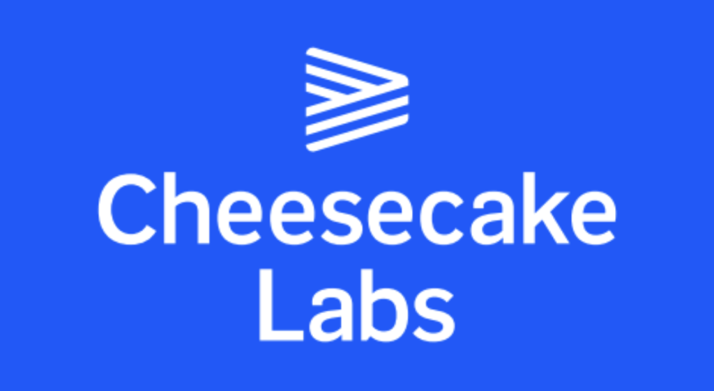

<p align="center">
   
</p>

<p align="center">
   <a href="https://linkedin.com/in/denis-ladeira-814365115/">
      
   </a>
  

  <a href="https://github.com/denismend/newspaper-reactjs/commits/dev_v1">
    
  </a>

  

  <a href="https://app.netlify.com/sites/cheesecake-denisladeira/deploys">
      
   </a>
</p>

<p align="center">
   :cake: Cheesecake Frontend Challenge - Newspaper page</p>

<div align="center">
  <sub>Newspaper Page project. Built with ❤︎ by
    <a href="https://github.com/denismend">Denis Ladeira</a> and
    <a href="https://github.com/denismend/newspaper-reactjs/graphs/contributors">
      contributors
    </a>
  </sub>
</div>

<p align="center"
  <br /><br />
  <span>
    <a href="https://cheesecake-denisladeira.netlify.app/">Demo</a>
  </span>
</p>

<p align="center">
  
</p>

# :pushpin: Table of Contents

* [Technologies](#computer-technologies)
* [Features](#rocket-features)
* [How to Run](#construction_worker-how-to-run)
* [Found a bug? Missing a specific feature?](#bug-issues)
* [Contributing](#tada-contributing)
* [License](#closed_book-license)

# :computer: Technologies
This project was made using the follow technologies:

* [Typescript](https://www.typescriptlang.org/)
* [React](https://reactjs.org/)
* [context-api](https://reactjs.org/)
* [axios](https://github.com/axios/axios)
* [styled-components](https://styled-components.com/)
* [material-ui](https://material-ui.com/)
* [unform](https://github.com/Rocketseat/unform)
* [yup](https://github.com/jquense/yup)
* [react-router-dom](https://reactrouter.com/web/guides/quick-start)
* [react-animations](https://www.npmjs.com/package/react-animations)
* [react-icons](https://github.com/react-icons/react-icons)

# :rocket: Features

* Static Web Page to show articles from a Newspaper
* Search by topics clicking on Navbar items
* Login page
* Interests page
* Responsible page (tablet and mobile)

# :construction_worker: How to run
```bash
# Clone the project on your computer via Download (option Code -> Download ZIP)
    - If you want to do it with Git, make sure you have Git installed,
      follow the link https://git-scm.com/
    - then run the command in terminal:
        $ git clone https://github.com/denismend/newspaper-reactjs.git

# In the terminal or prompt(cmd), access the project root;
```

### 💻 Run Project
```
# Install Dependencies
$ npm install

# Run Aplication
$ npm start
```
Go to http://localhost:3000/ to see the result.

# :bug: Issues

Feel free to **file a new issue** with a respective title and description on the the [NewsPaper Page](https://github.com/denismend/newspaper-reactjs/issues) repository. If you already found a solution to your problem, **i would love to review your pull request**!

# :tada: Contributing

There are many forms to contribute with the project, first of all you can give this github repo a Star.

If you want do help with the code follow the steps bellow

```ps
# Fork using GitHub official command line
# If you don't have the GitHub CLI, use the web site to do that.
$ gh repo fork denismend/newspaper-reactjs

# Clone your fork
$ git clone {your-fork-url}
$ cd denis-ladeira-frontend

# Create a branch with your feature
$ git checkout -b {branch-name}

# Make the commit with your changes
$ git commit -m 'Feat: {feature-name}'

# Send the code to your remote branch
$ git push origin {branch-name}
```

# :closed_book: License

Released in 2020 :closed_book: License

Made with love by [Denis Ladeira](https://github.com/denismend) 🚀.
This project is under the [MIT license](./LICENSE).
